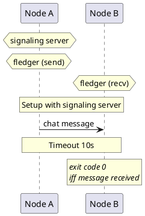

# Exp1 dummy

Testing the waters.

Run two nodes. On node A, send a message. On node B, wait for that message.

If nodeB gets the message, the playbook succeeds.

If the timeout of 10s is reached, the playbook fails.

## PlantUML diagram

